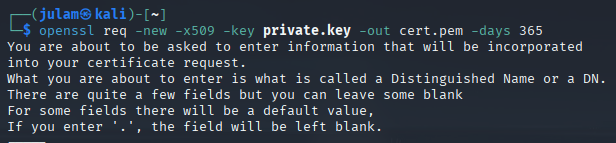
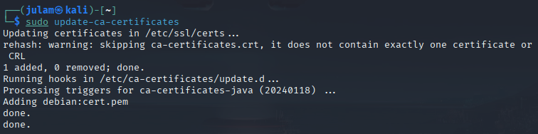

# Generate and Manage Digital Certificates Using OpenSSL #
## OBJECTIVE: Create a self-signed certificate using OpenSSL to understand certificate management ##

1. **Generate personal private key**

*State requirements with openssl*

```bash
openssl genrsa -out private.key 2048
```

2. **Create digital certificate with private key**

```bash
openssl req -new -x509 -key private.key -out cert.pem -days 365
```


3. **Install certificate for future testing uses**

```bash
sudo cp cert.pem /usr/local/share/ca-certificates/cert.crt
```


4. **Updating system for current available certs**

*trusts* the newly generated cert (for future test use)

```bash
sudo update-ca-certificates
```


5. **openssl x509 -in cert.pem -text -noout**

*inspects the cert*

```bash
openssl x509 -in cert.pm -text -noout
```

