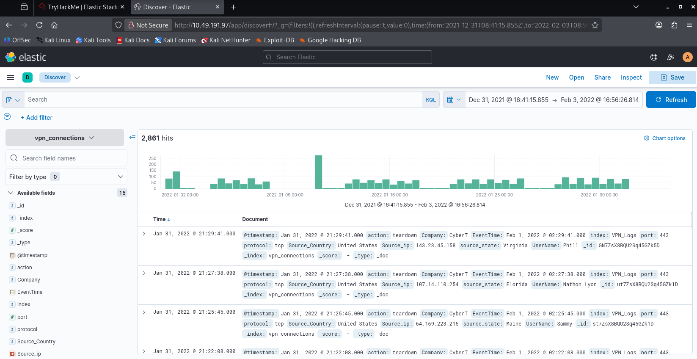
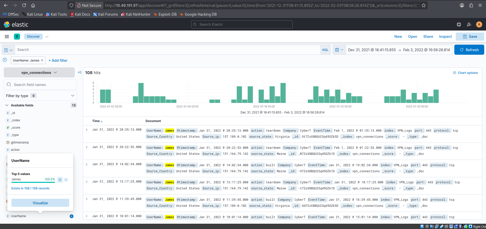
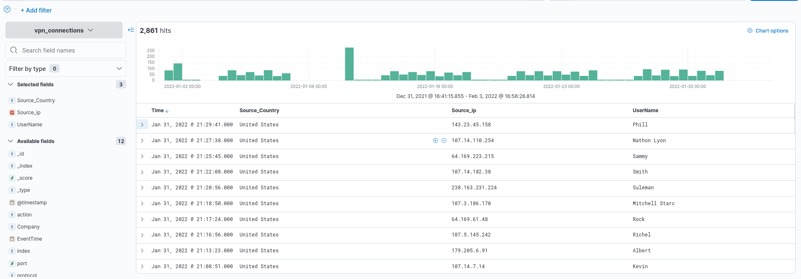
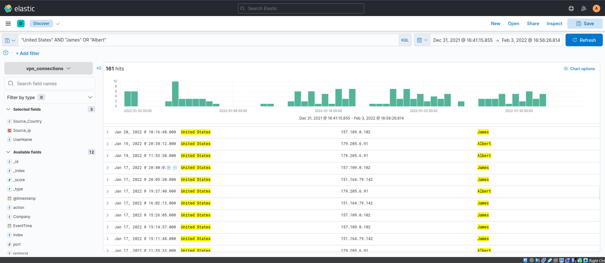
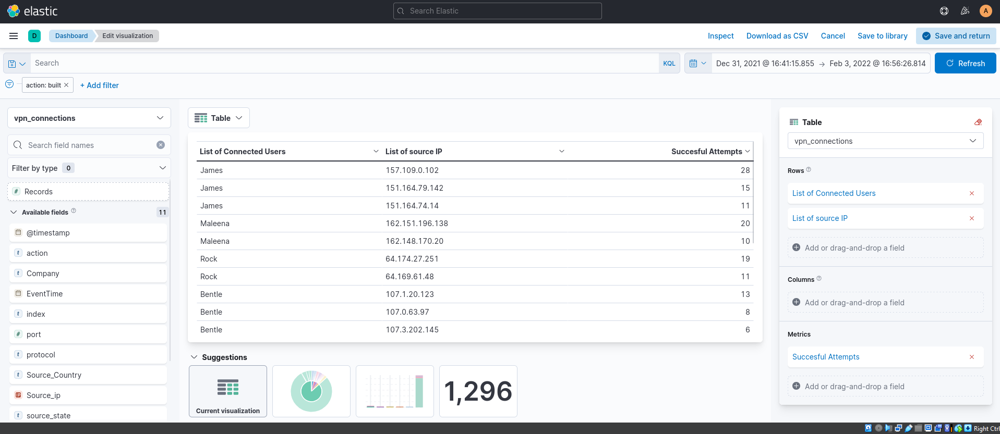
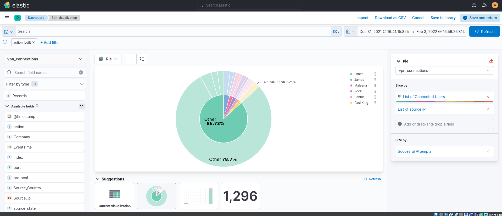
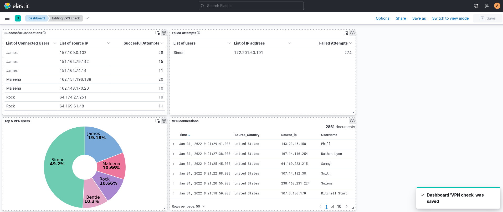

# Elastic basics
## Objective: to use basic filters to parse for data on json file

1. **Setting up filter timeline for events to look at**

*2861 hits for entirety of January 2022 within the json file*




2. **To search for number of events for UserName: James**

```
UserName:James
```


*this yields 108 hits relating to UserName: James within the json file*


3. **To add filter view of 1) Source_Country 2) Source_ip 3) UserName for current data**



*current dashboard now displays the above criteria for easier view of entries*


4. **To search for UserName: James or Albert from Source_Country: United States with KQL**

```
"United States" AND "James" OR "Albert"
```


*this yields 161 hits relating to the above criteria within the json file*


5. **To create Table Visualization of UserNames and successful attempts**



*can see List of connected Users sorted by the number of successful attempts by Source_IP, showing how many times they logged in with different devices*


6. **Pie chart Visualization of UserNames and successful attempts**



*shows that while there are a number of user attempts, majority may not be successful attempts and are created by other users*


7. **Dashboard Visualization of all successful and failed attempts**



*created dashboard VPN check to show the whole picture of all the connection attempts and also linked to original 2861 hit's data on right*

