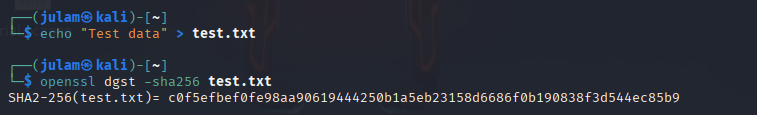
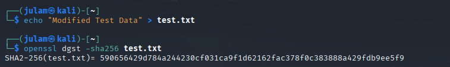
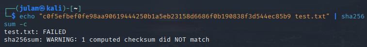
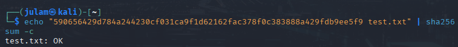

# Understanding Hashing inputs and how to use #
## OBJECTIVE: to check edited input against original hash

1. **create .txt file that contains test input**
```bash
echo "test data" > test.txt
```

2. **Use OpenSSL to hash current test file with sha256**

*OpenSSL is encryption software, SHA256 is hashing method*

```bash
openssl dgst -sha256 test.txt
```


*creating test.txt file and hashing with SHA256*


3. **modify test data to create difference in hash output**
```bash
echo "Modified test data" > test.txt
```

4. **rehash modified file**
```bash
openssl dgst -sha256 test.txt
```


*modify content of test.txt file and hashing again*


5. **decrypt original hash with sha256**
```bash
echo "c0f5efbef0fe98aa90619444250b1a5eb23158d6686f0b190838f3d544ec85b9 test.txt" | sha256sum -c
```


*expected failure output because file is already edited*


6. **decrypt modified hash with sha256**
```bash
echo "590656429d784a244230cf031ca9f1d62162fac378f0c383888a429fdb9ee5f9 test.txt" | sha256sum -c
```


*decrypting modified file's output = ok*
