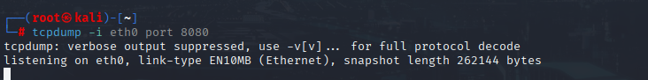
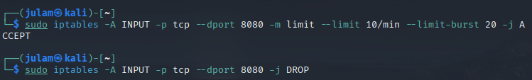
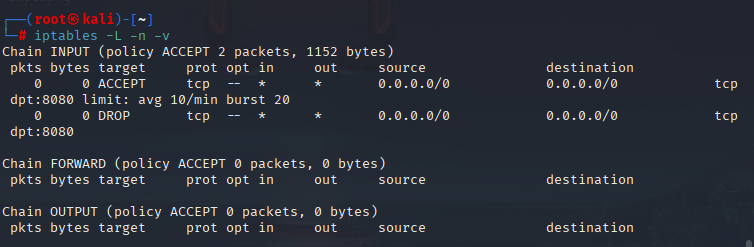
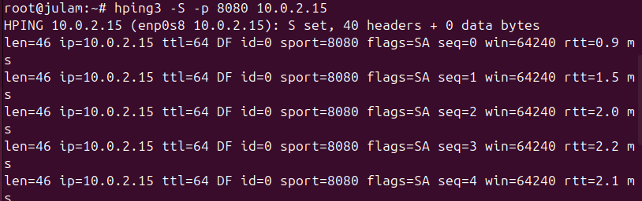
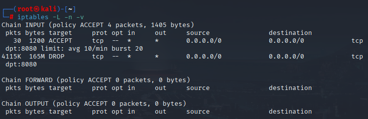

# To Simulate a DDOS SYN flooding and result of mitigation methods #
## Objective: Configure firewall rule via iptables to effectively block traffic ##

1. **check tcp ouput on Kali**
```bash
sudo tcpdump -i eth0 port 8080
```

*at rest traffic*

2. **configure iptables rules for IB traffic**
```bash
sudo iptables -A INPUT -p tcp --dport 8080 -m limit --limit 10/min --limit-burst 20 -j ACCEPT
```
*below for excess traffic*
```bash
sudo iptables -A INPUT -p tcp --dport 8080 -j DROP
```


3. **initial iptables output from rule configuration**
```bash
sudo iptables -L -n -v
```


4. **run hping3 on Ubuntu to simulate SYN packet flooding**
```bash
sudo hping3 -S -p 8080 --flood 10.0.2.15
```


5. **result iptables output after flood**
```bash
sudo iptables -L -n -v
```


