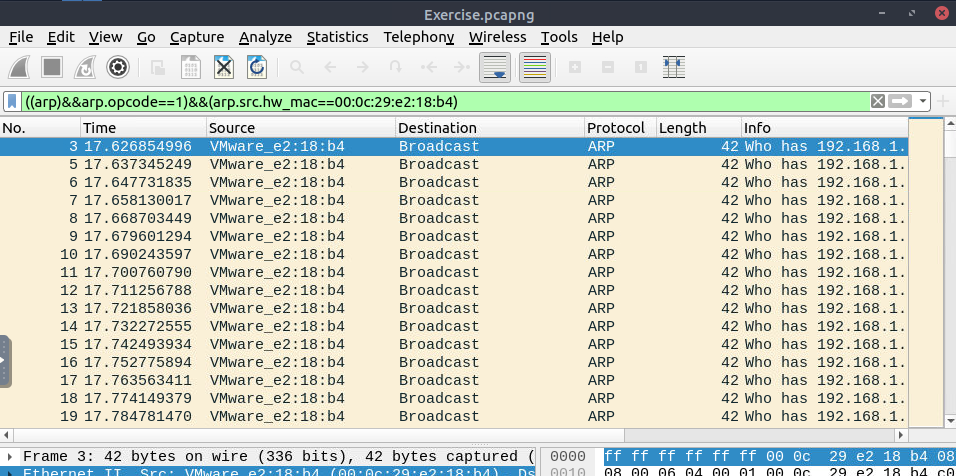
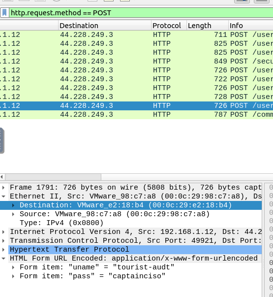
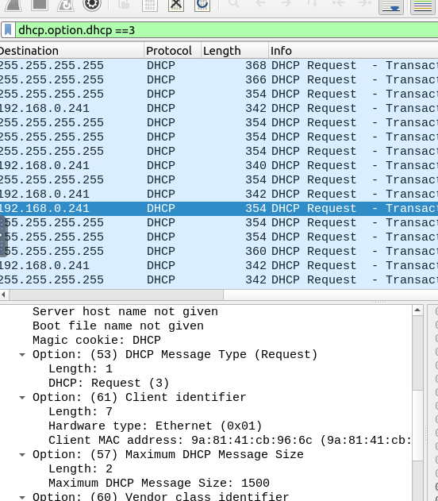
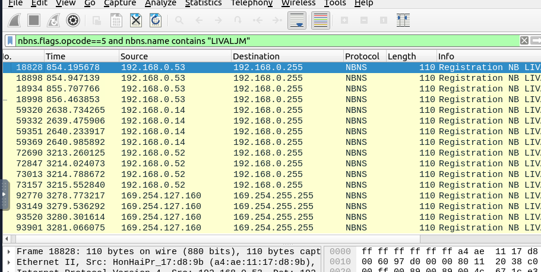
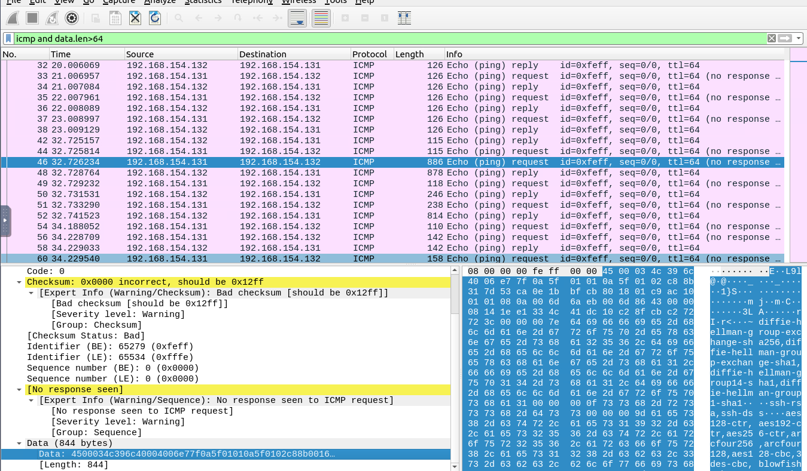
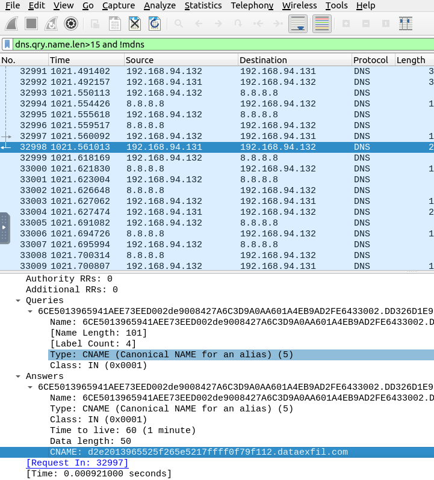

# Network Analysis
## Objective: to use advanced Wireshark filters to check for signs of malicious threat actors across different protocols in .pcap file

---

1. **analyse for the times a certain MAC addr has sent out arp request queries for different ip addr across the LAN**

```
((arp)&&arp.opcode==1)&&(arp.src.hw_mac==00:0c:29:e2:18:b4)
```



> *indicates possible attempts at arp spoofing, especially since source mac addr is continuously asking for mac of all ip addr throughout LAN*

<br>
<br>

2. **http request for the username and pw can be seen in plain view**

```
http.request.method==POST
```

> *can see unencrypted view of user information*



<br>
<br>

3. **shows the times client requested for DHCP, possibly an indicator of MITM attack**

```
dhcp.option.dhcp==3
```




<br>
<br>

4. **checks for netbios name registration requests from devices specifically from LIVALJM**

```
nbns.flags.opcode==5 amd nbns.name contains "LIVALJM"
```




<br>
<br>

5. **checks for possible icmp tunneling by looking at packets with unusal data lengths**

```
icmp and data.len>64
```



> *since 64 is standard length for a ping, it shows possible tunneling of data within an icmp packet, in this case, the base64 string in the data field contains a hidden message*

<br>
<br>

6. **checks for possible dns tunneling by looking at the dns cname field**

```
dns.qry.name.len>15 and !mdns
```



> *shows that in packet 32998, the dns cname contains a base64 dns name, usually as a means to execute commands via dns queries*

<br>
<br>
