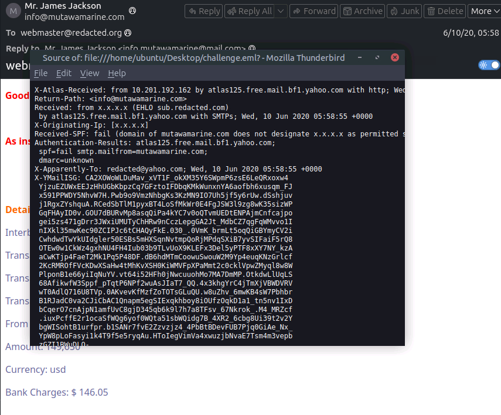
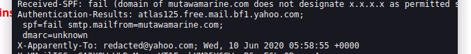
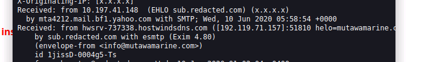
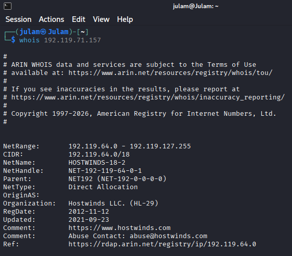
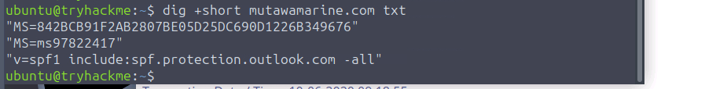
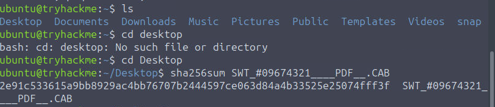
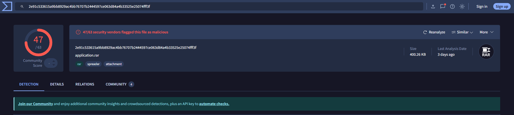

# Phishing Analysis
## Objective: to analyse a collection of email files for phishing indicators and determine source or potential malicious sites

---

1. **open the source code of the .eml file to show phishing email from info@mutawamarine.com**



*shows that the email has failed spf, both smtp check and dmarc*


---

2. **notice that the email was first sent from hostwindsdns.com and later to yahoo server before arriving at user inbox**

*origin ip is 192.119.71.157*



---

3. **conducting whois on terminal to check for actual original org of message**

```bash
whois 192.119.71.157
```



*this yields Hostwinds LLC*

---

4. **checking for the spf policy entry for this mutawamarine.com**

```bash
dig +short mutawamarine.com txt
```



*shows spf was configured to block sender domain*

---

5. **checking for the DMARC policy entry for this mutawamarine.com**

```bash
dig +short _dmarc.mutawamarine.com txt
```


*shows dmarc was also configured to block sender domain*

---

6. **hashing phishing file attachment with sha256 for checking**

```bash
cd Desktop
```

```bash
sha256sum SWT_#09674321____PDF__.CAB
```

*received sha256 hash of file*


---

7. **checking on virustotal to see if hash matches known malware signatures**


*shows that hash of file matches known malicious signatures*


