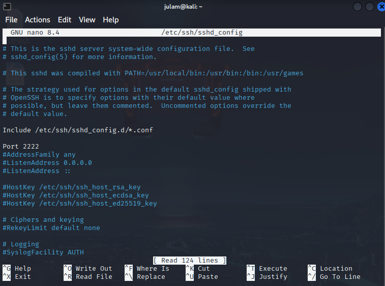
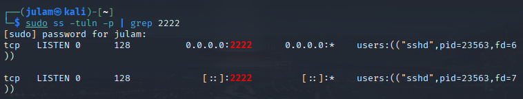
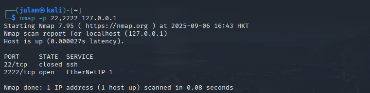
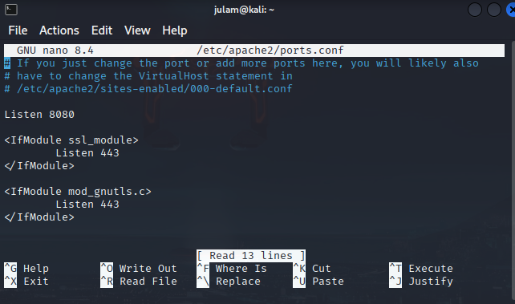
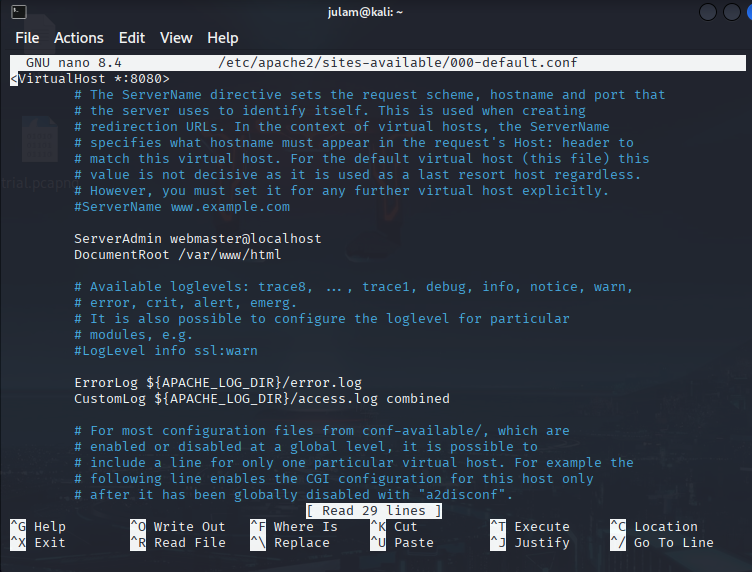
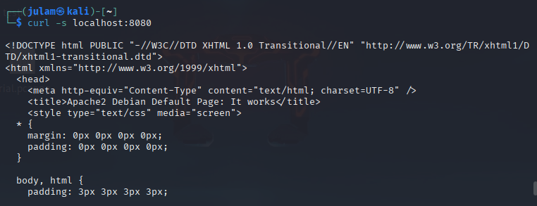
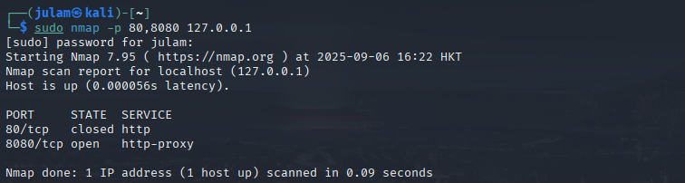

# Port obfuscation Lab for port 22 and port 80
## OBJECTIVE: to obfuscate default ports to harden system and make it less predictable for guessing exploitable services.

## Port 22:

1. **using Kali VM, identify the current network address.**
```bash
ip a
```
2. **nmap to scan for open ports on current network address**
```bash
sudo nmap -sS -p- 127.0.0.1
```
3. **configure ssh listening port**
```bash
sudo nano /etc/ssh/sshd_config
```


4. **configure ssh connection port**
```bash
sudo -p 2222 julam@localhost
```
![SSH connection port](images/2_PortObfuscationLab/Lab2_2.png

5. **restarting ssh to confirm validitiy**
```bash
sudo systemctl restart ssh
```
6. **Add firewall rule**
```bash
sudo ufw allow 2222/tcp
```
7. **Check current listening ports** *on 22 and 2222 specifically*
```bash
sudo ss -tuln -p | grep 2222
sudo ss -tuln -p | grep 22
```


8. **Confirm updated port status**
```bash
sudo nmap -sS -p 22,2222 127.0.0.1
```


*Port 22 successfully obfuscated*

## Port 80:

1. **Finding port 80 process**
```bash
ss -tuln -p | grep 80
```
2. **Configure apache2 inbound settings**
```bash
sudo nano /etc/apache2/ports.conf
```
*edit #Listen 80 -> Listen 8080*


3. **Configure apache2 outbound settings**
```bash
sudo nano /etc/apache2/sites-available/000-default.conf
```
*edit VirtualHost :80 to :8080*


4. **restart apache2**
```bash
sudo systemctl restart apache2
```

5. **add firewall rule**
```bash
sudo ufw allow 8080/tcp
```

6. **check apache2 status on inbound port 8080 traffic**
```bash
curl localhost:8080
```
*shows the line  <title>Apache2 Debian Default Page: It works</title>*


7. **Check current listening ports** *on 80 and 8080 specifically*
```bash
sudo ss -tuln -p | grep 8080
sudo ss -tuln -p | grep 80
```
*both outputs the same*

8. **Confirm updated port status**
```bash
sudo nmap -p 80,8080 127.0.0.1
```


*Port 80 succcessfully obfuscated*
