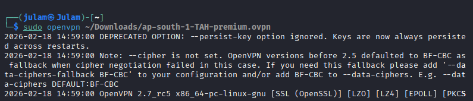
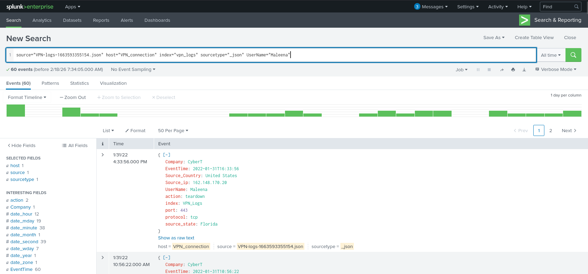
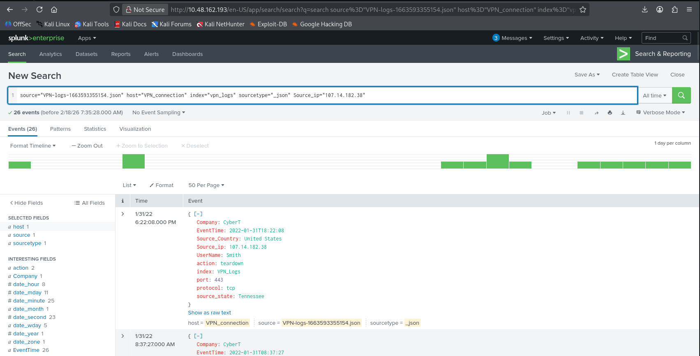
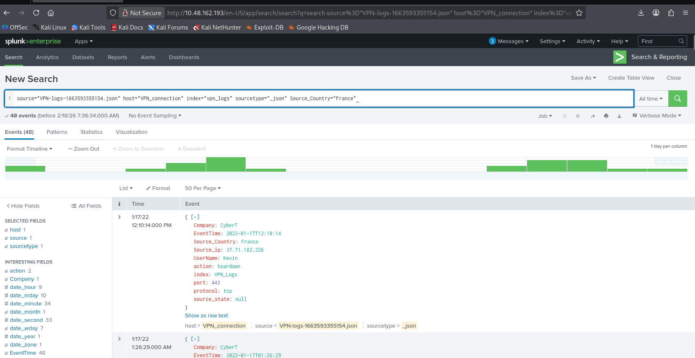

# Splunk basics
## Objective: to use basic filters to parse for data on json file

1. **connect to THM VPN for Splunk connection**

```bash
sudo openvpn ~/Downloads/ap-south-1-TAH-premium.ovpn
```



2. **To search for number of events for UserName="Maleena"**

```
source="VPN-logs-1663593355154.json" host="VPN_connection" index="vpn_logs" sourcetype="_json" UserName="Maleena"
```


*this yields 60 events relating to UserName="Maleena" within the json file*


3. **To search for number of events for Source_ip="107.14.182.38"**

```
source="VPN-logs-1663593355154.json" host="VPN_connection" index="vpn_logs" sourcetype="_json" Source_ip="107.14.182.38"
```


*this yields 26 events relating to UserName="Maleena" within the json file*


4. **To search for number of events for Source_Country="France"**

```
source="VPN-logs-1663593355154.json" host="VPN_connection" index="vpn_logs" sourcetype="_json" Source_Country="France"
```


*this yields 48 events relating to Source_Country="France" within the json file*
