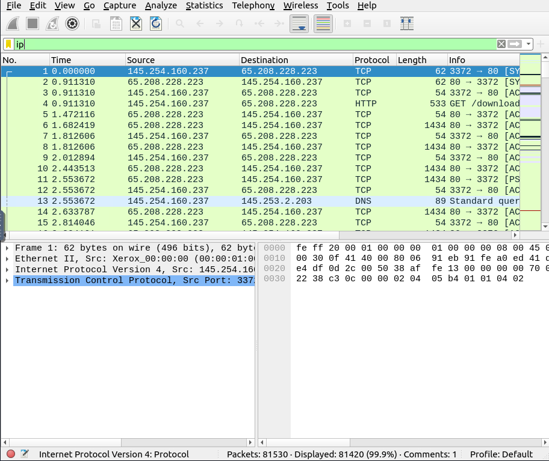
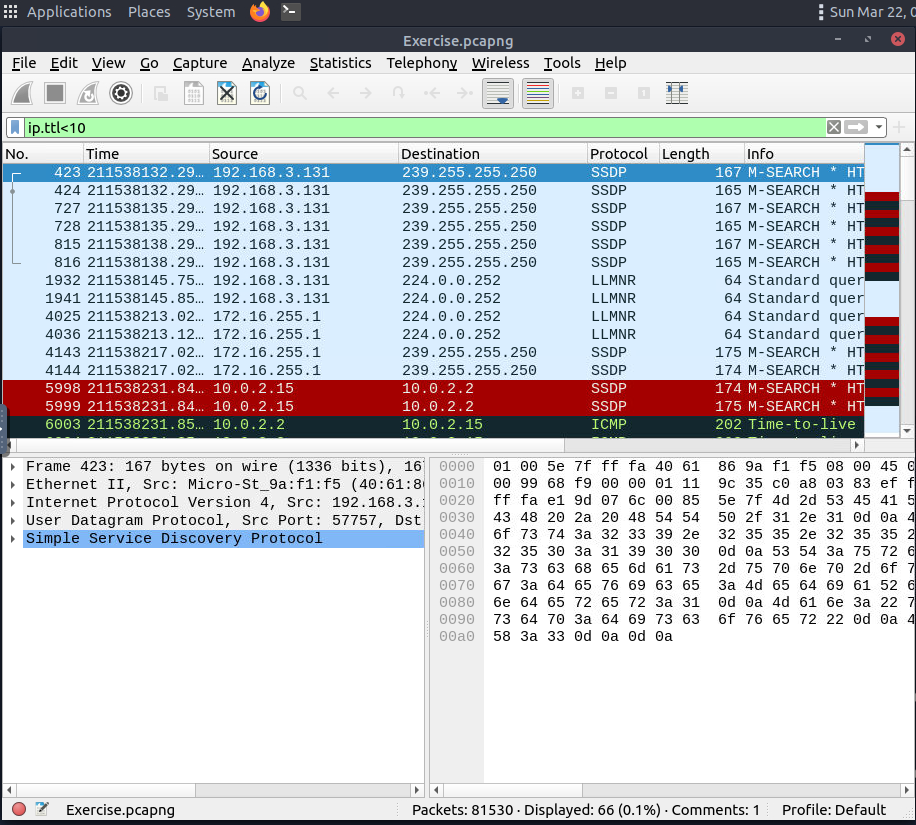
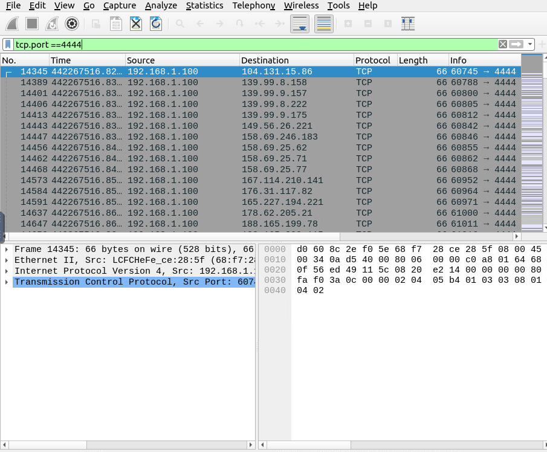
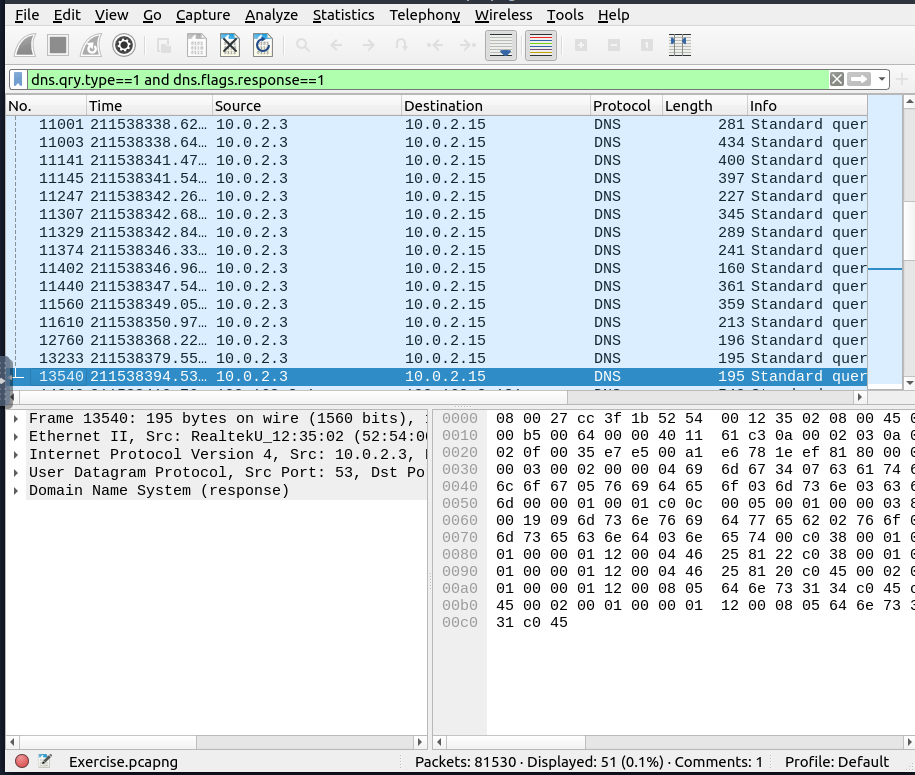
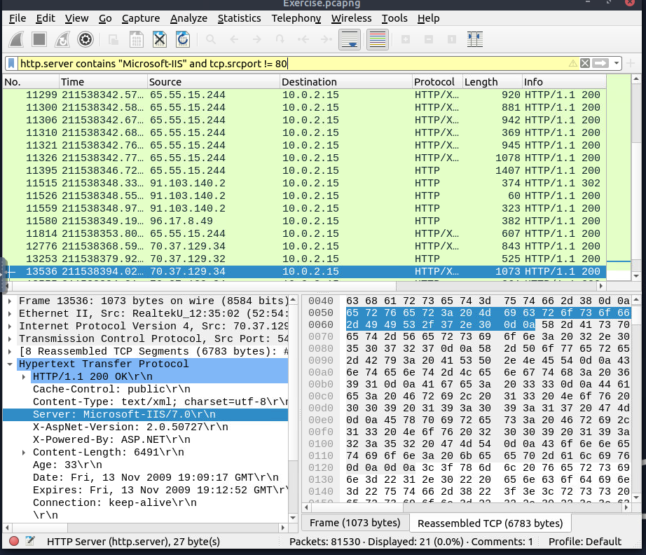
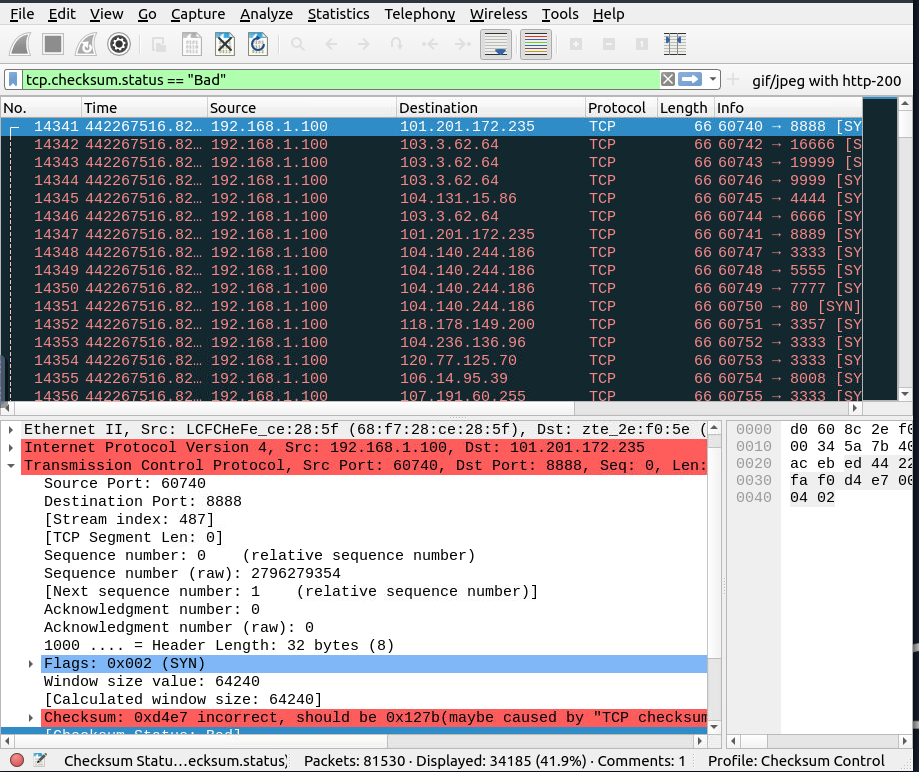

# Wireshark basics
## Objective: to use filters to parse for data on pcap file and answer THM questions

1. **lookup of ip packets within the pcap file**

```
ip
```



*this displayed 81420 packets for pcap file*


2. **looking for ip packets with specific time to live parameter (<10)**

```
ip.ttl<10
```


*this displayed 66 packets for pcap file*


3. **Checking for source and destination packets coming from tcp port 4444**

```
tcp.port == 4444
```



*technically an unusual port for tcp packets assuming this is a normal office*


4. **Checking for ipv4 address answers via DNS queries and response types**

```
"dns.qry.type==1 AND dns.flags.reponse==1"
```


*dns query type 1 relates to ipv4 addr while dns response type 1 is the answer, so there are 51 packets that show a response to domain to ipv4 addr resolution*


5. **Checking for packets with advanced filter for Microsoft-IIS server name and not coming from tcp source port 80**

```
http.server contains "Microsoft-IIS" and tcp.srcport != 80
```



*this displayed 21 packets that fit the above criteria, however noted that the filter displays yellow for possible unreliable results*


6. **Checking for TCP bad checksum packets, that indicate network or hardware level error causing transmission issues**

```
tcp.checksum.status == "Bad"
```



*shows a capture of 34185 tcp packets failed checksum*

